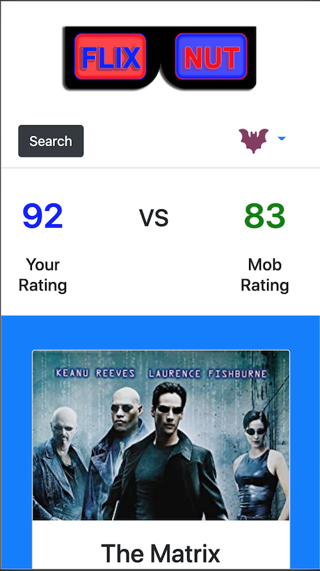

# flix-nut

# Table of Contents

* [Concept](#Concept)
* [Process](#Process)
* [Issues](#Issues)
* [Future Plans](#Future-Plans)
* [Video](#Video)
* [Link](#Link)
* [Screenshot](#Screenshot)

# Concept

The look of the concept to the final version is not that different.

Changed colors for certain items such as the buttons and background.

Layout stayed the same with only changin the look of the profile picture.

Mainly ran out of time to have it look 100% identical and we were not fans of having purple

# Process

First Register as a new member with a valid email and password.

Any future visits the user only needs to sign in.

Next click the search button and search for any movie.

Next rate the movie on a scale of 0-100.

After the user will see their rating compared to other users.

Finally click on the bat profile picture to log out.

# Issues

Communication with heroku was the first hurdle.

found we needed to adjust our config.json.

Next was the route when entering username and password to be saved to the SQL server.

the process of learning passport with sequelize caused us to rebuild the backend 3 times.

async functions took a few days to cooperate with each other to show movie results.

# Future-Plans

Add a Filter Dropdown Menu for sorting Movie List by Your Rating, Mob Rating, and Date Added.

Add a To Watch List for Movies the User wants to watch.

The ability to share in social media.

A friends feed to view and compare movies on their list.

# Link 

[Link to Heroku site](https://flix-nut.herokuapp.com/)

# Screenshot

