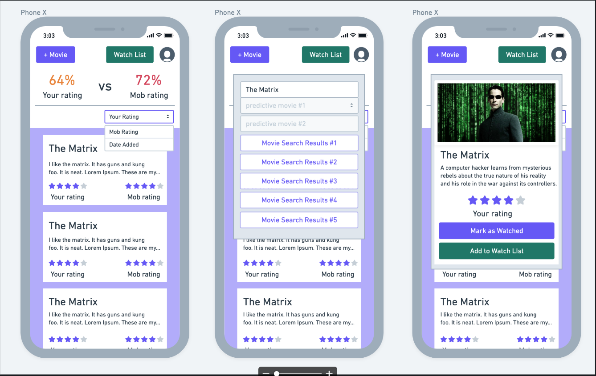

# flix-nut

# Table of Contents

* [Process](#Process)
* [Issues](#Issues)
* [Future Plans](#Future-Plans)
* [Video](#Video)
* [Link](#Link)
* [Screenshot](#Screenshot)

# Process

The look of the concept to the final version is not that different.

Changed colors for certain items such as the buttons and background.

Layout stayed the same with only changin the look of the profile picture.

The process to navigate the project is as follows:

# Issues

Communication with heroku was the first hurdle.

Next was the route when entering username and password to be saved to the SQL server.

# Future-Plans

Add a Filter Dropdown Menu for sorting Movie List by Your Rating, Mob Rating, and Date Added.

Add a To Watch List for Movies the User wants to watch.

# Link 

[Link to Heroku site](https://flix-nut.herokuapp.com/)

# Screenshot

